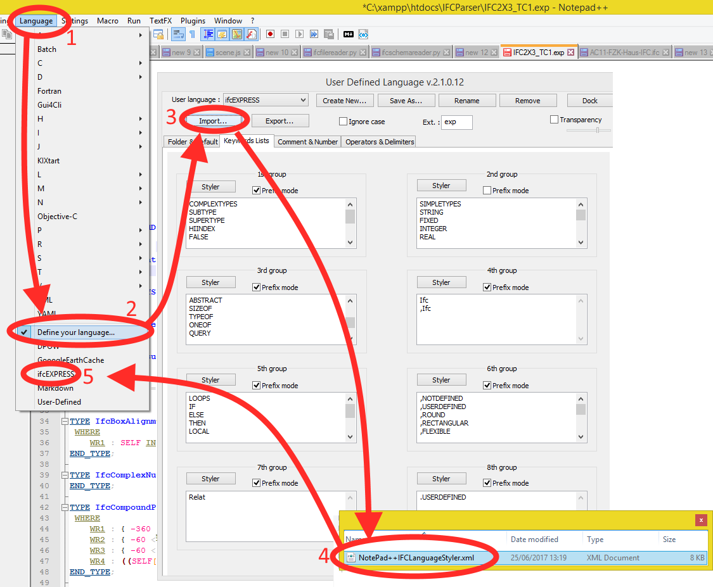
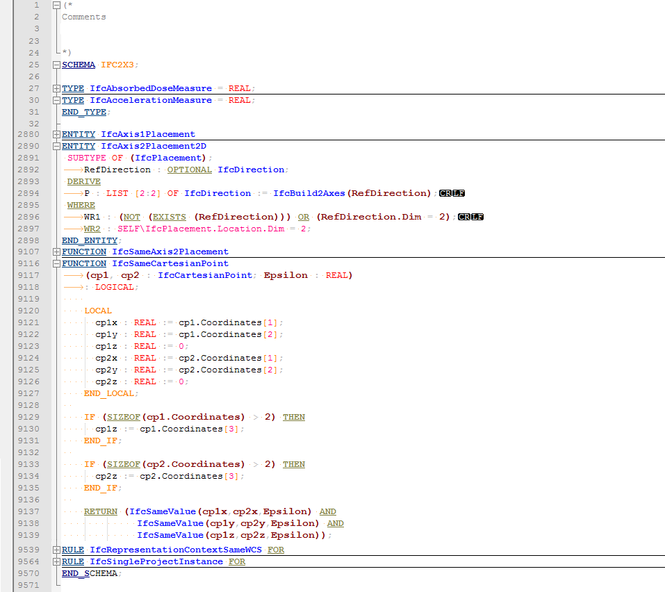
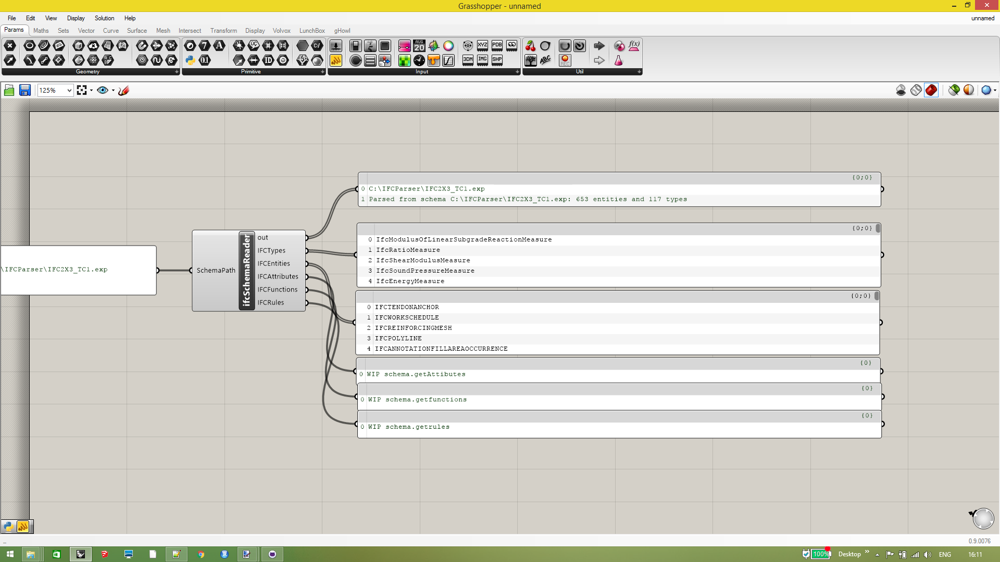
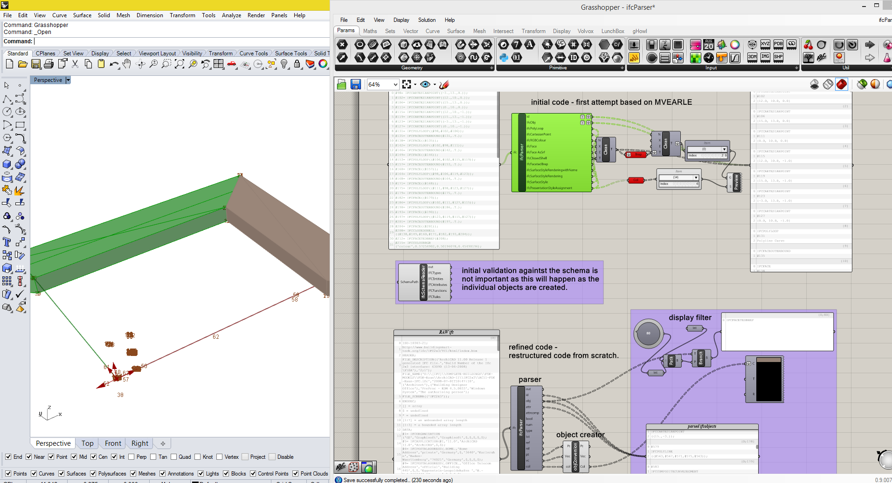

# Contents
[IFC Express Notepad ++ Styler](https://github.com/JulesBuh/ifcParser#ifc-express-notepad--styler)

[Grasshopper IFC Parser](https://github.com/JulesBuh/ifcParser#grasshopper-ifc-parser)

## IFC Express Notepad ++ Styler

To install in Notepad++

go to Languages

define your Language
	
Import the [`IFCExpressLanguageStyler.xml file`](NotePad_Styles/NotePad++IFCExpressLanguageStyler.xml) and [`IFCLanguageStyler.xml file`](NotePad_Styles/NotePad++IFCLanguageStyler.xml)

 
	
A preview of the styles and folding code is shown in the screenshot below
	
 

## Grasshopper IFC Parser
 [`ifcSchemaReader`](Grasshopper_Components/WIP/ifcSchemaReader.ghuser) reads the ifc Schema and outputs the Entities in UPPERCase and types in as written in CamelCase
 requires [Python.gha](https://github.com/mcneel/ghpython) based on the code written by [mvaerle](https://github.com/mvaerle/python-ifc)
 
 
 
  [`ifcFileReader`](Grasshopper_Components/WIP/ifcParser.gh) is the work area for development. A refinement of the fileParser has been written to begin to organise outputs by types which are grafted in the grasshopper environment. Standard grashopper components can then be used to display the geometry correctly.
 
 
 